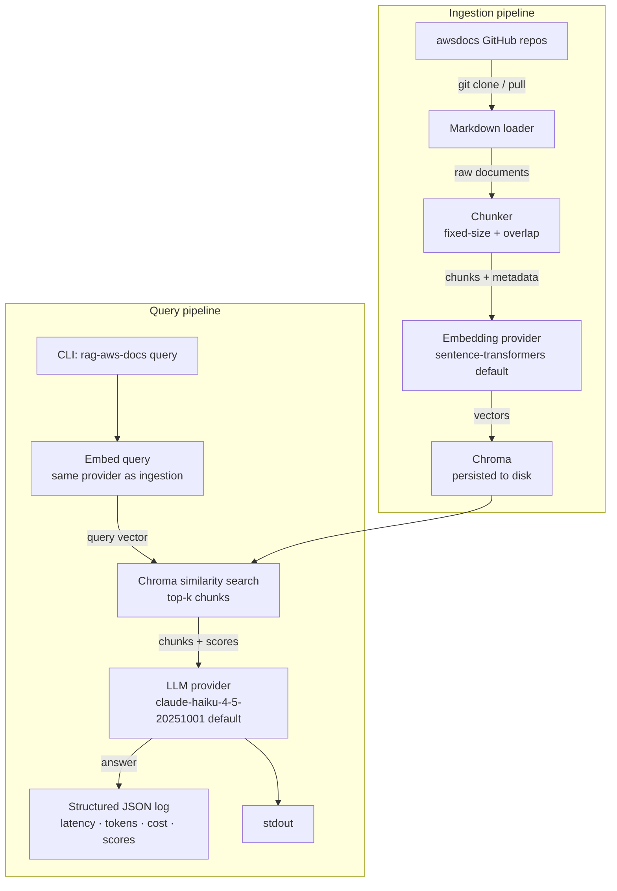

# rag-aws-docs

A retrieval-augmented generation system that ingests AWS documentation from
public GitHub repositories and answers questions about it. The goal is not to
build a production-grade AWS chatbot — it's to demonstrate that I understand
RAG architecture, the observability it requires, the cost it carries, and the
production considerations a platform engineer thinks about before deploying it.

---

## Architecture



---

## Quickstart

```bash
git clone https://github.com/mrpowellbrian/rag-aws-docs.git
cd rag-aws-docs

# Install (requires uv: https://docs.astral.sh/uv/)
make install

# Copy and fill in your Anthropic API key
cp .env.example .env

# Ingest the default corpus (IAM + Lambda docs from awsdocs GitHub)
rag-aws-docs ingest

# Ask a question
rag-aws-docs query "What is the maximum execution timeout for a Lambda function?"
```

The first `ingest` run clones ~80 MB of markdown, chunks it, and embeds it
locally. On a 2023 laptop with the default `all-MiniLM-L6-v2` model it takes
roughly 3–5 minutes. Subsequent runs skip unchanged files.

---

## Configuration

All settings are readable from environment variables or a `.env` file.
See `.env.example` for the full list.

| Variable | Default | Description |
|---|---|---|
| `ANTHROPIC_API_KEY` | — | Required for generation. |
| `LLM_PROVIDER` | `anthropic` | `anthropic` or `bedrock` |
| `LLM_MODEL` | `claude-haiku-4-5-20251001` | Any Claude model ID |
| `EMBEDDING_PROVIDER` | `local` | `local` or `openai` |
| `EMBEDDING_MODEL` | `all-MiniLM-L6-v2` | sentence-transformers model name or OpenAI model |
| `CHUNK_SIZE` | `512` | Max tokens per chunk |
| `CHUNK_OVERLAP` | `64` | Token overlap between adjacent chunks |
| `TOP_K` | `5` | Number of chunks retrieved per query |
| `CHROMA_PATH` | `./chroma_db` | Chroma persistence directory |
| `LOG_FILE` | `./rag_queries.jsonl` | Structured query log output |

---

## Design decisions and trade-offs

### Vector store: Chroma vs. pgvector vs. FAISS

**Chroma** persists to disk with no external dependencies, has a clean Python
API, and is trivial to set up in CI. For a corpus of ~10k chunks it performs
fine — similarity search is in the tens of milliseconds. The trade-offs: no
horizontal scaling, no SQL joins with metadata, and Chroma's on-disk format
is not stable across major versions (migration required on upgrades).

**pgvector** would be the right choice if the system already has a Postgres
instance: you get transactional metadata updates, familiar tooling, and the
ability to filter by metadata at query time. It adds an infra dependency that
a portfolio project doesn't need.

**FAISS** is faster at large scale but is an in-memory index — you manage
serialization yourself, and there's no built-in metadata store. It's the right
choice at millions of vectors where Chroma's overhead matters. At the scale
of AWS docs it's premature.

### Chunking strategy

Fixed-size chunking with token-based boundaries and a 64-token overlap.
Chunks are split at the nearest sentence boundary within a tolerance window
to avoid cutting mid-sentence.

The alternative is semantic chunking (split on embedding similarity drops
between sentences). Semantic chunking often produces better retrieval but
adds latency to ingestion, depends on a second embedding call per candidate
boundary, and is harder to reason about in a debugging session. For a corpus
of structured technical documentation that already has section headers as
natural break points, fixed-size performs well and the trade-off is worth it.
Chunk size (512 tokens) was chosen to fit comfortably within a context window
while keeping enough context per chunk to answer narrow questions without
always needing multi-chunk retrieval.

### Swappable embedding provider

The embedding model determines the shape and meaning of every vector in the
store. You cannot mix embedding providers in the same Chroma collection — if
you switch models, you must re-ingest. The abstraction exists so the system
can be re-ingested with OpenAI `text-embedding-3-small` (better quality,
costs ~$0.02/million tokens) or Amazon Titan Embeddings (stays within the AWS
trust boundary) without changing any other code.

### Cost per query

With `claude-haiku-4-5-20251001` at current API pricing ($0.80/MTok input,
$4.00/MTok output) and a typical query:

| Component | Tokens | Cost |
|---|---|---|
| System prompt | ~200 | — |
| 5 retrieved chunks × 512 tokens | ~2,560 | — |
| User question | ~20 | — |
| **Total input** | **~2,780** | **$0.0022** |
| Generated answer | ~300 | **$0.0012** |
| **Total per query** | | **~$0.0034** |

A team running 1,000 queries/day would spend roughly $3.40/day or ~$100/month
at this model tier. Switching to Sonnet roughly 10× that cost; switching to
a self-hosted model via Bedrock (e.g., Llama on Inferentia) changes the cost
model entirely to instance hours.

---

## Where this fails

**Hallucination.** The LLM will sometimes generate plausible-sounding but
incorrect answers, especially for questions where the retrieved chunks are
adjacent but not directly relevant. Without an eval harness running golden
Q&A pairs against known-correct answers (e.g., using Claude to judge
correctness), there's no systematic way to detect this.

**Stale documentation.** Ingestion is a one-shot CLI command. There is no
scheduled re-ingestion, no change detection beyond git pull, and no
notification when upstream docs change. A production system would run
re-ingestion on a schedule, diff the chunk store, and alert on large diffs
(which usually indicate a major doc restructure rather than routine updates).

**No reranking.** The retrieval step returns the top-k chunks by cosine
similarity. Similarity score is a proxy for relevance, not relevance itself —
a chunk can be semantically close to the query without being the best chunk
to answer it. A cross-encoder reranker (e.g., `cross-encoder/ms-marco-MiniLM-L-6-v2`)
applied after retrieval measurably improves answer quality, at the cost of
additional latency (~100–200ms) and a second model dependency. Left out here
to keep the architecture legible.

**No streaming.** The CLI waits for the full LLM response before printing.
In a UI or API context this would be unacceptable for answers longer than a
sentence or two. The Anthropic SDK supports streaming; wiring it through
the abstraction layer is straightforward but adds complexity that obscures
the architectural point.

---

## What productionizing this looks like

### Auth, rate limiting, abuse protection

An API layer (FastAPI behind API Gateway, or a Lambda function URL) would add
JWT or API key auth, per-key rate limits enforced at the gateway layer, and
request size limits. The LLM call is the expensive operation — a single
abusive client can run up significant API costs before any circuit breaker
fires if you don't rate-limit at the ingress.

### Eval harness

A golden dataset of 50–100 question/answer pairs over the corpus, evaluated
on every code change. Metrics to track: answer correctness (LLM-as-judge),
retrieval recall (did the right chunks appear in the top-k?), and latency
percentiles. Without this, you have no signal that a model upgrade, a
chunking change, or a Chroma version bump has degraded answer quality.

### Drift detection

Retrieval performance degrades in two ways: upstream docs change (chunks
become stale) and the query distribution shifts (users start asking questions
the current chunking strategy handles poorly). The `rag_queries.jsonl` log
contains retrieval scores per query — a weekly job that plots the p50/p95
score distribution against a baseline is a cheap early warning system.

### Cost controls and circuit breakers

- Hard cap on input tokens per request (reject queries that would produce an
  oversized prompt after chunk injection)
- Monthly budget alert on the Anthropic API key
- Exponential backoff with jitter on API errors; fail open with a degraded
  "retrieval only, no generation" response if the LLM is unavailable
- Log token counts on every call; alert if the 7-day rolling average cost
  per query exceeds a threshold

### Deployment on AWS

**Lowest operational overhead:** Lambda (generation) + API Gateway +
Bedrock (no Anthropic API key to manage) + EFS or S3 for the Chroma DB.
Chroma on EFS works but adds cold-start latency; at scale you'd migrate to
a managed vector store (OpenSearch with k-NN, or Aurora pgvector).

**More control:** ECS Fargate task running the FastAPI server with Chroma on
an EBS volume. Predictable latency, no cold starts, but you own the task
definition, scaling policy, and ALB configuration.

The Lambda approach is the right starting point — it scales to zero when idle
and costs nothing in a demo/low-traffic scenario. Migrate to ECS when cold
starts exceed acceptable latency or when stateful Chroma on Lambda becomes
operationally painful.

---

## Tested with

| Tool | Version |
|---|---|
| Python | 3.12 |
| anthropic SDK | >= 0.49 |
| chromadb | >= 0.5 |
| sentence-transformers | >= 3.0 |
| claude-haiku-4-5-20251001 | — |
| ruff | >= 0.9 |
